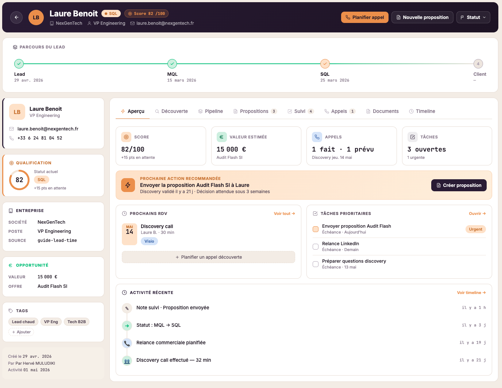

# Hervé "Kamanga" Muludiki

### Software Craftsman · Craft + AI Coach · Full Stack Developer

*Taking back control of your code, in the age of AI.*

[🇫🇷 Français](README.md) · **🇬🇧 English**

---

## About

I help engineering teams and their managers **take back control of their systems**. 25 years in the field as a tech lead, fractional CTO and technical coach inside large organizations (BNP Paribas, Crédit Agricole, Canal+, Agirc-Arrco, Société Générale, JCDecaux, Air France).

Today my work is focused on a single axis:

- **[Craft + AI Coach](https://www.kamanga.fr/)**: transforming engineering culture (Clean Architecture, DDD, TDD, pair programming, software quality) and governing AI inside the development cycle (shared guardrails, security of generated code, controlled cost)

### AI Craft, my current conviction

> *The art of using AI to build well-made applications, on a tightly controlled budget.*

AI speeds up production. It does not replace judgment. The teams that come out of this transition ahead are the ones that understand what they are building. That is exactly where I work.

---

## Current projects

### Conduit Full Stack

A real full-stack TypeScript project, run like a production system: an `api` + `web` +
`shared` monorepo in NestJS, Next.js and Zod, implementing the
[RealWorld](https://realworld-docs.netlify.app/) spec (code name *Conduit*, a Medium clone
with articles, comments, favorites and author following).

**What is at stake.** What separates a project that lasts ten years from one that becomes
unmanageable at 18 months is almost never the talent of the team: it is the frame put in
place on day one. The problem is that this frame does not fit in slides. It is read in the
files.

**Why it exists.** To make that frame concrete and verifiable. Since the functional scope is
frozen by the RealWorld spec, the *what* is already decided: only the *how* is left, and
that is exactly what this repository exposes. It is also the executable implementation of
[Le Référentiel Craft](https://www.kamanga.fr/referentiel-craft), my 25 years of practice
condensed into 100 practices across 21 phases.

**My methodology.** Every increment follows the same path and leaves a trace at each step:
frame it (PRD, explicit out of scope), specify it (versioned requirements with their
acceptance criteria), decide (immutable ADRs), implement (code and tests in the same unit,
on a branch cut from `staging`), review and ship (review in Conventional Comments, promotion
from `staging` to `main`). Interrupted work can be picked up without rebuilding the context
from memory.

**What this project demonstrates:**

- **Hexagonal architecture**: ports in the domain, adapters in the infrastructure, a pure domain without a single NestJS or Prisma import.
- **DDD and Clean Architecture**: bounded contexts, an immutable aggregate root, validated value objects, the dependency rule held across 4 layers.
- **One single shared model**: the Zod schema is the only definition, the TypeScript type is inferred from it. Front and back consistency becomes a compile-time dependency instead of a contract to keep in sync.
- **Testing strategy**: the official RealWorld conformance suite vendored at a pinned SHA (128 Playwright tests, never edited), coverage required per layer, and a guard against a green but empty run.
- **Tooled quality**: Biome, cognitive complexity blocking in CI, dependency-cruiser on hexagonal boundaries, knip on dead code.
- **Requirements as code**: versioned requirements, schema-validated frontmatter, requirements-to-tests traceability matrix generated in CI.
- **Security by design**: fail-fast environment validation at boot, anti-IDOR filtered in SQL, server-side authority on authorship, secrets kept out of the repository, documented threat model.
- **Documentation as code**: immutable ADRs with an automated gate, guides, standards, all in versioned Markdown.
- **Delivery**: Conventional Commits, `feature` to `staging` to `main` by promotion, merge commit and never squash.
- **Agentic workflow and SDLC**: the tooled cycle I use daily, under human gates.

> **This repository is meant to be read, not just cloned.** Every guardrail is a real,
> commented file, readable without additional context. Open one at random.
>
> [**→ Explore conduit-fullstack**](https://github.com/kamangacode/conduit-fullstack) · [**→ Discover Le Référentiel Craft**](https://www.kamanga.fr/referentiel-craft)

### CRM Coaching

A SaaS application for professional coaches (Next.js 16, NestJS 11, Prisma, hexagonal architecture, embedded AI). Written 100% in AI Craft.

  

### Others

- **[kamanga.fr blog](https://kamanga.fr/blog)**: software craftsmanship and AI Craft, made accessible.
- **YouTube channel [@kamangacode](https://youtube.com/@kamangacode)**: tutorials, field feedback, modern engineering practices taken apart.

---

## What I believe, no compromise

- **Software quality** is a business decision, not a technical option.
- **Technical debt** is financial debt. It has a real, measurable cost.
- **Craftsmanship** is a guardrail, not a dogma.
- **AI** raises the urgency of human judgment, it does not remove it.
- A good **transformation** makes teams autonomous, not dependent on the consultant.

---

## Tech Stack

### AI and Agents

### Frontend and Full Stack

### Backend and Data

### Testing and Quality

### DevOps and Infrastructure

### Architecture and Methodologies

### Compliance and regulation

---

## Certifications and education

| Year | Type | Title |
|-----:|------|-------|
| 2023 | Certification | Manager Certification (Ecole 109) |
| 2023 | Education | **Executive MBA** in IT Management and Entrepreneurship (Epitech Executive, Paris) |
| 2023 | Education | **Information Systems Management** (IB Cegos, Paris): IT master plan, digital transformation, governance, financial performance, risk management, agile methods |
| 2021 | Certification | Certified Scrum Master (Scrum Alliance) |
| 2021 | Certification | Practitioner Coach (Coach Académie, Paris) |
| 2008 | Education | **Master's degree** in IT, networks and telecom engineering, banking information systems track (M2IRT, ITIN / CCI Versailles) |
| 2007 | Education | **Master 1**, IT project management, information systems engineering track (ITIN) |
| 2004 | Education | **BTS Informatique de Gestion** (two-year IT degree), enterprise network administration track (E.C.T.E.I, Groupe ECE, Montreuil) |
| 2002 | Education | **Baccalauréat Scientifique** (French science high school diploma), engineering sciences track (Lycée La Tourelle, Sarcelles) |

---

## Latest articles

I publish regularly on [kamanga.fr/blog](https://kamanga.fr/blog): field feedback, engineering practices taken apart, AI Craft, technical governance. **Posts are written in French**; the titles below are translated for reference.

| Date | Category | Article |
|------|----------|---------|
| 2026-06-17 | Technical debt | [The craft toolkit that keeps an app from dying at 18 months](https://kamanga.fr/fr/dette-technique/boite-a-outils-craft-app-durable) |
| 2026-06-10 | Technical debt | [Cognitive complexity: the lock that keeps debt from coming back](https://kamanga.fr/fr/dette-technique/verrou-complexite-cognitive-code-ia) |
| 2026-05-25 | Technical debt | [5 reasons why your app dies at 18 months](https://kamanga.fr/fr/dette-technique/5-raisons-app-meurt-18-mois) |
| 2026-05-19 | AI | [Who owns the production bug: you or Claude?](https://kamanga.fr/fr/intelligence-artificielle/a-qui-appartient-le-bug-ia) |
| 2026-05-16 | AI | [10x more PRs is not 10x more value shipped: the 4 metrics that lie](https://kamanga.fr/fr/intelligence-artificielle/illusion-productivite-10x-pr) |
| 2026-05-13 | AI | [The Claude code that "works" is often the one that costs you the most](https://kamanga.fr/fr/intelligence-artificielle/faux-ami-code-claude-coute-cher) |
| 2026-05-10 | AI | [All tests green, and three days later it breaks in production](https://kamanga.fr/fr/intelligence-artificielle/code-claude-tests-passent-plante-prod) |
| 2026-05-01 | Technical debt | [Dependabot: setting up your silent teammate against dependency debt](https://kamanga.fr/fr/dette-technique/dependabot-craft-gestion-dependances) |

[**→ See all posts**](https://kamanga.fr/blog)

---

## GitHub stats

---

### Does any of this sound like your situation?

**Let's talk.** No pitch. No sales. 30 minutes to ask the right questions and identify one or two leads.

[**→ Book a call**](https://app.kamanga.fr/forms/discovery-call) · [**→ Follow me on LinkedIn**](https://linkedin.com/in/kamangacode)

